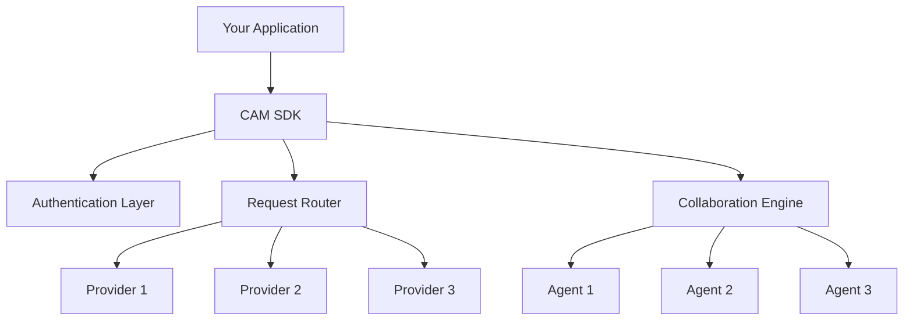

# Complete Arbitration Mesh - SDKs

Official Software Development Kits (SDKs) for the Complete Arbitration Mesh platform, providing seamless integration across multiple programming languages and frameworks.

## Overview

The Complete Arbitration Mesh SDKs provide unified access to both:
- **Classic CAM Routing**: Intelligent request routing to optimal AI providers
- **Multi-Agent Collaboration**: Advanced agent orchestration and collaboration capabilities
- **Hybrid Operations**: Combined routing and collaboration for complex workflows

## Available SDKs

| Language | Package | Documentation | Status |
|----------|---------|---------------|--------|
| **JavaScript/TypeScript** | [@cam/sdk-js](./javascript/) | [Docs](./javascript/README.md) | ✅ Production Ready |
| **Python** | [cam-sdk](./python/) | [Docs](./python/README.md) | ✅ Production Ready |
| **Go** | [cam-sdk-go](./go/) | [Docs](./go/README.md) | ✅ Production Ready |
| **Java** | [cam-sdk-java](./java/) | [Docs](./java/README.md) | ✅ Production Ready |
| **C#** | [Cam.Sdk](./csharp/) | [Docs](./csharp/README.md) | ✅ Production Ready |
| **Rust** | [cam-sdk](./rust/) | [Docs](./rust/README.md) | 🚧 Beta |

## Quick Start

### JavaScript/TypeScript
```bash
npm install @cam/sdk-js
```

```typescript
import { CAMClient } from '@cam/sdk-js';

const cam = new CAMClient({
  apiKey: process.env.CAM_API_KEY,
  endpoint: 'https://api.cam.example.com'
});

// Simple routing
const response = await cam.route({
  prompt: 'Explain quantum computing',
  preferences: { cost: 'optimize', performance: 'fast' }
});

// Multi-agent collaboration
const collaboration = await cam.collaborate({
  task: 'Create a marketing plan',
  agents: ['market-researcher', 'content-writer', 'data-analyst']
});
```

### Python
```bash
pip install cam-sdk
```

```python
from cam_sdk import CAMClient

cam = CAMClient(
    api_key=os.environ['CAM_API_KEY'],
    endpoint='https://api.cam.example.com'
)

# Simple routing
response = cam.route(
    prompt='Explain quantum computing',
    preferences={'cost': 'optimize', 'performance': 'fast'}
)

# Multi-agent collaboration
collaboration = cam.collaborate(
    task='Create a marketing plan',
    agents=['market-researcher', 'content-writer', 'data-analyst']
)
```

## Features by Tier

### Community Tier
- Basic request routing
- Standard authentication
- Rate limiting: 1,000 requests/hour
- JavaScript and Python SDKs
- Community support

### Professional Tier
- Advanced routing with custom policies
- Multi-agent collaboration (up to 5 agents)
- Webhook support
- All SDKs available
- Priority support
- Rate limiting: 10,000 requests/hour

### Enterprise Tier
- Unlimited collaboration agents
- Custom integrations
- Advanced security features
- SLA guarantees
- Dedicated support
- Custom rate limits

## Architecture



## Common Patterns

### Error Handling
All SDKs provide consistent error handling with retry logic and exponential backoff:

```typescript
try {
  const response = await cam.route(request);
} catch (error) {
  if (error instanceof CAMRateLimitError) {
    // Wait and retry
    await new Promise(resolve => setTimeout(resolve, error.retryAfter * 1000));
    return cam.route(request);
  }
  throw error;
}
```

### Configuration Management
Environment-based configuration is supported across all SDKs:

```bash
# Environment variables
CAM_API_KEY=your_api_key
CAM_ENDPOINT=https://api.cam.example.com
CAM_TIMEOUT=30000
CAM_MAX_RETRIES=3
```

### Observability
Built-in metrics and tracing support:

```typescript
const cam = new CAMClient({
  apiKey: process.env.CAM_API_KEY,
  observability: {
    metrics: true,
    tracing: true,
    logLevel: 'info'
  }
});
```

## Migration Guide

### From CAM v1.x
If you're migrating from CAM v1.x, the new SDK is backward compatible:

```typescript
// Old way (still works)
const response = await cam.arbitrate(request);

// New way (recommended)
const response = await cam.route(request);
```

### From IACP
IACP functionality is now integrated:

```typescript
// Old IACP
const iacp = new IACPClient();
const result = await iacp.orchestrate(task);

// New CAM
const result = await cam.collaborate(task);
```

## Framework Integrations

### React
```typescript
import { useCAM, CAMProvider } from '@cam/react-sdk';

function App() {
  return (
    <CAMProvider apiKey={process.env.CAM_API_KEY}>
      <ChatComponent />
    </CAMProvider>
  );
}

function ChatComponent() {
  const { route, loading, error } = useCAM();
  
  const handleSubmit = async (prompt: string) => {
    const response = await route({ prompt });
    // Handle response
  };
}
```

### Next.js
```typescript
// pages/api/cam.ts
import { CAMClient } from '@cam/sdk-js';
import { NextApiRequest, NextApiResponse } from 'next';

const cam = new CAMClient({
  apiKey: process.env.CAM_API_KEY
});

export default async function handler(req: NextApiRequest, res: NextApiResponse) {
  const response = await cam.route(req.body);
  res.json(response);
}
```

### Express.js
```typescript
import express from 'express';
import { CAMClient } from '@cam/sdk-js';

const app = express();
const cam = new CAMClient({
  apiKey: process.env.CAM_API_KEY
});

app.post('/api/chat', async (req, res) => {
  const response = await cam.route(req.body);
  res.json(response);
});
```

## Testing

All SDKs include comprehensive testing utilities:

```typescript
import { createMockCAMClient } from '@cam/sdk-js/testing';

const mockCAM = createMockCAMClient({
  responses: {
    route: { text: 'Mock response', provider: 'mock-provider' }
  }
});

// Use in tests
const response = await mockCAM.route({ prompt: 'test' });
```

## Best Practices

### 1. API Key Management
- Use environment variables for API keys
- Rotate keys regularly
- Implement key rotation without downtime

### 2. Error Handling
- Implement exponential backoff for retries
- Handle rate limiting gracefully
- Log errors for debugging

### 3. Performance
- Use connection pooling
- Implement request caching where appropriate
- Monitor latency and error rates

### 4. Security
- Validate all inputs
- Use HTTPS for all requests
- Implement request signing for sensitive operations

## Support

- **Documentation**: [docs.cam.example.com](https://docs.cam.example.com)
- **API Reference**: [api.cam.example.com](https://api.cam.example.com)
- **Community**: [community.cam.example.com](https://community.cam.example.com)
- **Issues**: [github.com/cam/sdk-issues](https://github.com/cam/sdk-issues)

## Contributing

We welcome contributions to our SDKs. Please see the contributing guidelines in each SDK's repository.

## License

All SDKs are licensed under the Apache License 2.0. See [LICENSE](./LICENSE) for details.
